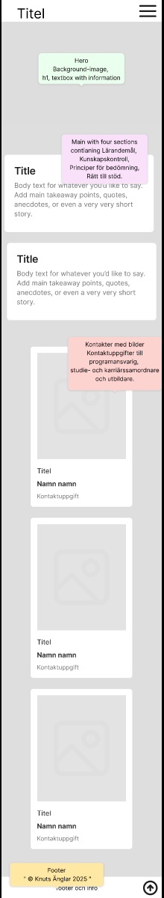
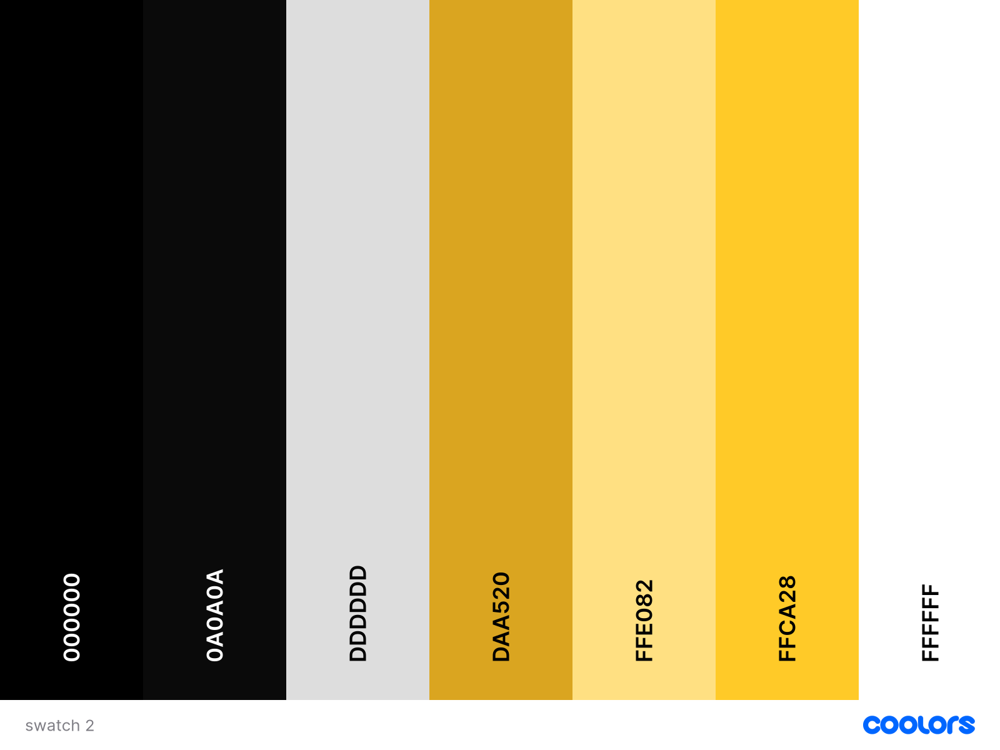

## Project Overview
This project aims to transform the course plan into an engaging and visually interesting experience that’s easier and more enjoyable to explore.

### Team Members
- *Scrum Master* - Axel
- *Project Owner* - Olivia
- *Designer* - Dennis
- *Developers* - Axel, Dennis, Mohammad, Olivia, Oligerta, Sarvin

### Milestones

| MVP                                                                                                    | status |
| ------------------------------------------------------------------------------------------------------ | ------ |
| Header/Nav for mobile and desktop with quick-links to sections.                                        | 100%     |
| Hero with background image, h1, textbox with information                                               | 100%     |
| Main with 4 sections contianing Lärandemål, Kunskapskontroll, Principer för bedömning, Rätt till stöd. | 100%     |
| Footer with " &copy; Knuts Änglar 2025 "                                                               | 100%     |

| Animations                               | status |
| ---------------------------------------- | ------ |
| Make the page more interactive and alive | 100%     |

| Add-ons          | status |
| ---------------- | ------ |
| Dark-mode        | 2%     |
| FAQ              | 100%     |
| Testimonials     | 0%     |
### Status:

Planning Stages

### Design Ideas:
##### Wireframe:

### Color Scheme

### Technologies

   
  <b>HTML5</b>  

   
  <b>CSS3</b>  

   
  <b>JavaScript</b>  

   
  <b>Figma</b>  

### Developer Notes
Minimum supported screen 375px

### Anders request
Vi adderade smooth scroll, med en enkel rad css html { scroll-behavior: smooth;}. 100% täckning för moderna browsers. Den förbättrar användarupplevesen då det blir en mycket skönare transition till sektionen man navigerar till då den scrollar ner istället för att "hoppa" till sektionen direkt.

malmo3-kursplan-projekt
Boiler room 13 oktober - kursplans projekt
